---

## 📸 System Screenshots & UI Walkthrough

### 🔐 Authentication
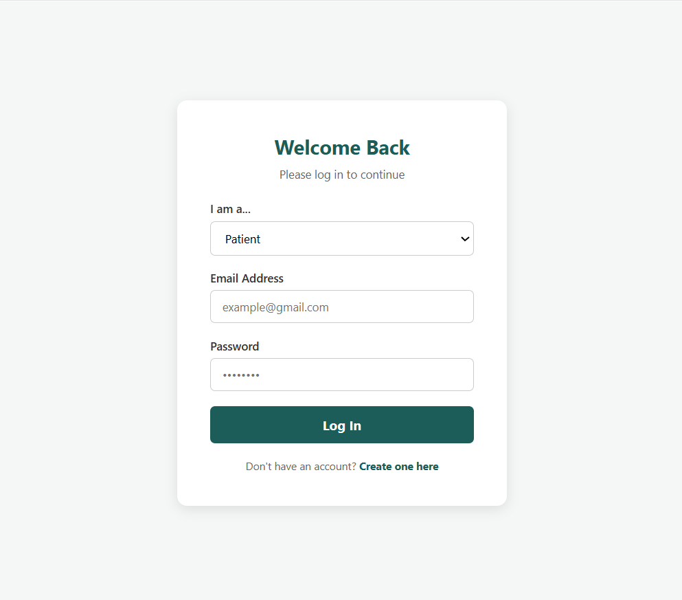

---

### 🛡️ System Administrator Portal
| Overview Dashboard | User Management |
| :---: | :---: |
| 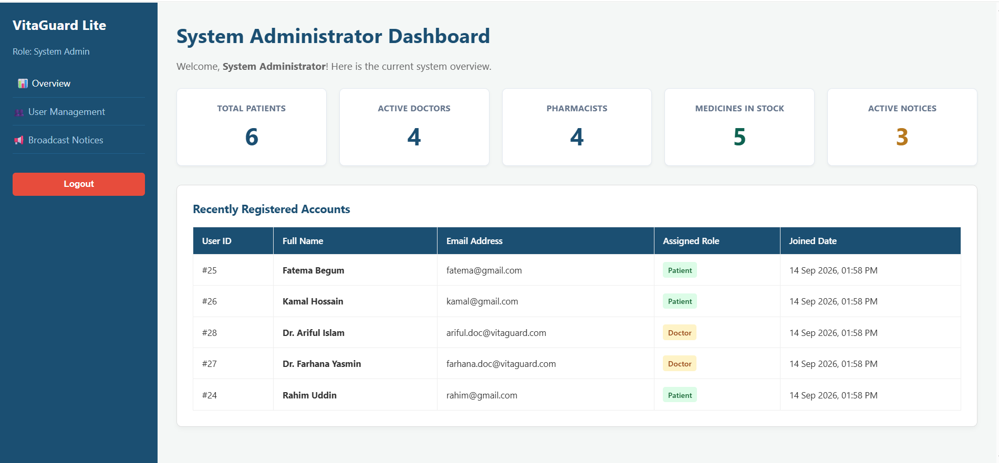 | 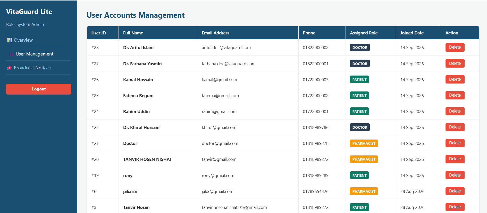 |

| Broadcast Announcements |
| :---: |
| 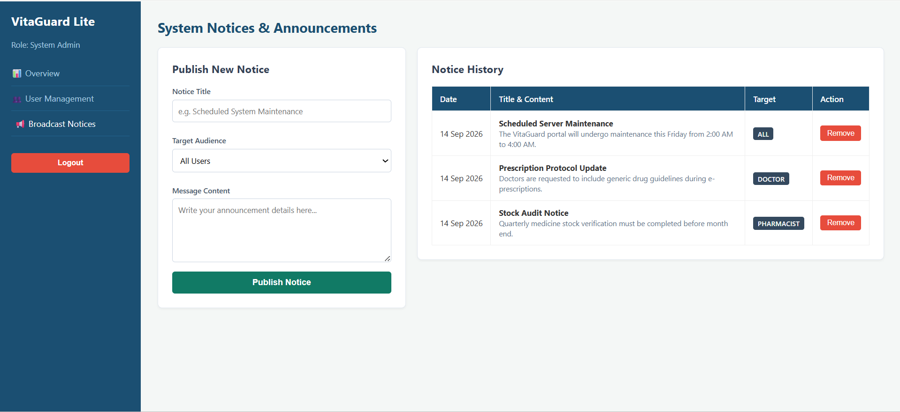 |

---

### 👨‍⚕️ Doctor Clinical Portal
| Consultation Queue | Digital Prescription Builder |
| :---: | :---: |
| 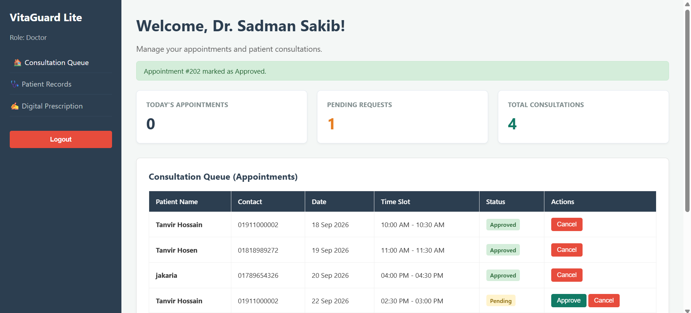 | 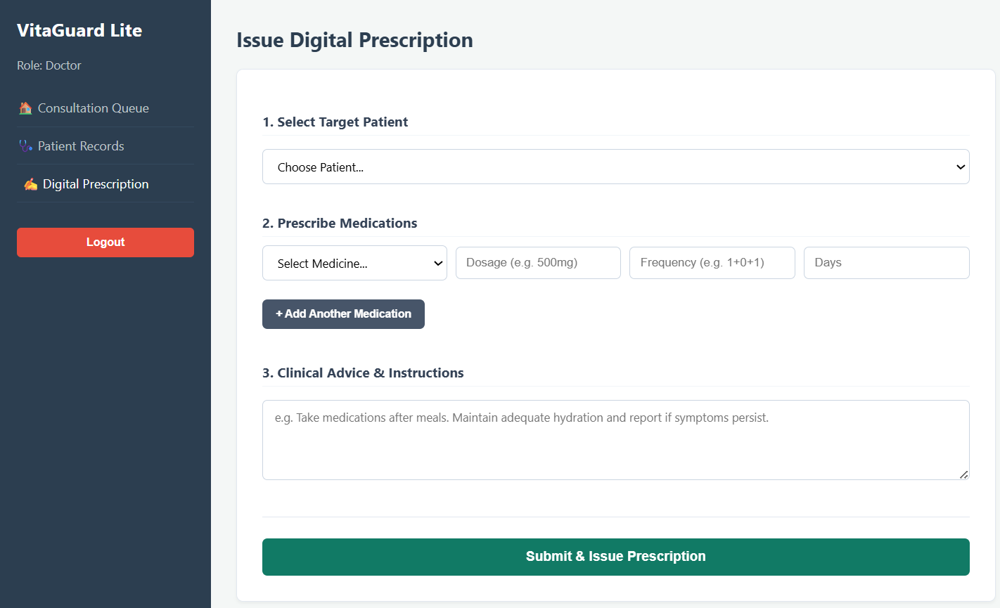 |

---

### 🩺 Patient Healthcare Portal
| Patient Dashboard | Health Vitals Logging |
| :---: | :---: |
| 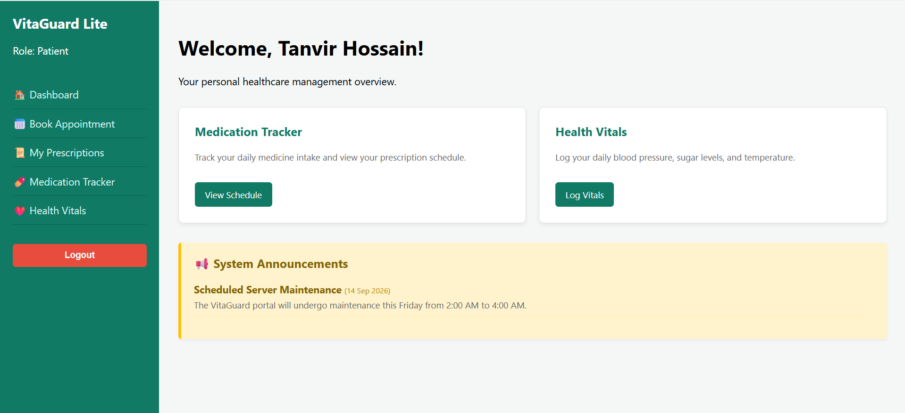 | 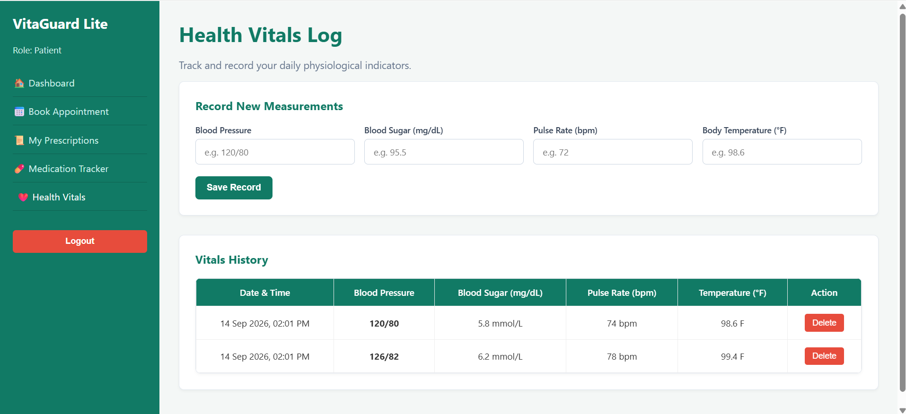 |

| Medication Tracker | Prescriptions History |
| :---: | :---: |
| 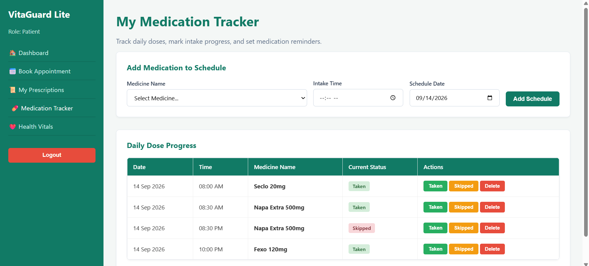 | 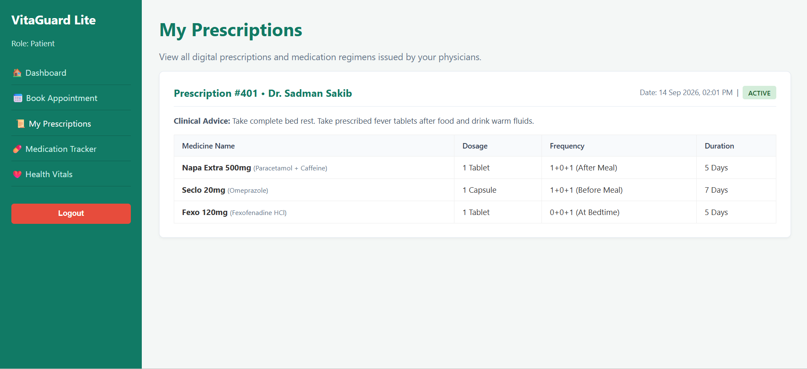 |

---

### 💊 Pharmacist Inventory & Dispense Portal
| Pharmacist Dashboard | Medicine Inventory Management |
| :---: | :---: |
| 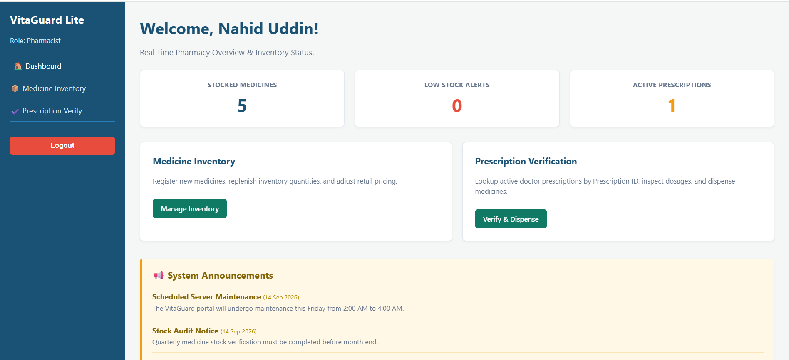 | 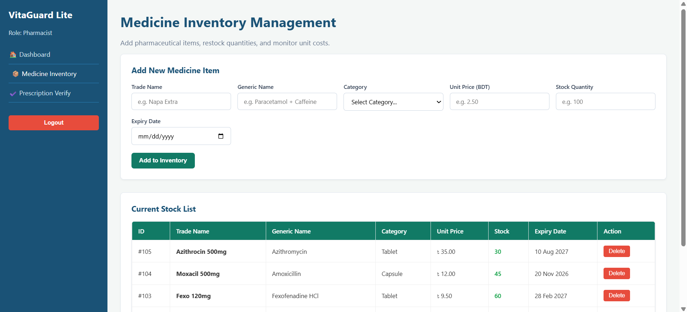 |

---

# 🏥 VitaGuard Lite — Role-Based Healthcare Management System

**VitaGuard Lite** is a centralized, role-based healthcare web application developed with native **PHP**, **MySQL**, **HTML5/CSS3**, and **JavaScript**. The platform bridges clinical consultation, pharmacy inventory, and continuous patient health monitoring into a single unified workflow.

---

## 🌟 Core System Highlights

* **Role-Based Access Control (RBAC):** Strict session-authenticated route protection for 4 distinct roles (Admin, Doctor, Patient, Pharmacist).
* **Transactional Digital Prescriptions:** Atomic SQL transactions ensuring that multi-item prescriptions and medical advice are saved reliably without partial failure.
* **Automated Stock Deduction:** Real-time synchronization between prescription fulfillment and pharmacy stock counts.
* **Continuous Health Monitoring:** Patient self-logging vitals dashboard for blood pressure, glucose, pulse, and temperature review.
* **Adherence Medication Tracker:** Patient-facing scheduled medicine intake tracker with interactive status toggles (`Taken` / `Skipped`).

---

## 👥 Module Architecture & Features

### 1. 🛡️ System Administrator Portal
* **System Overview:** High-level metrics tracking total system accounts across doctors, patients, and pharmacists.
* **User Management:** Monitor and regulate platform users with immediate account revocation privileges (protected against self-deletion).
* **Broadcast Notices:** Publish role-targeted announcements (`All`, `Patient`, `Doctor`, `Pharmacist`) with real-time propagation to respective dashboards.

### 2. 👨‍⚕️ Doctor Clinical Portal
* **Consultation Queue:** Overview of scheduled appointments and pending patient reviews.
* **Patient Health Records:** Search patient medical history by Patient ID to evaluate physiological trends before prescribing treatments.
* **Digital Prescription Builder:** Dynamic multi-item prescription interface to specify trade name, dosage, intake frequency (e.g., `1+0+1`), and duration days within a single clinical entry.

### 3. 🩺 Patient Healthcare Portal
* **Appointment Scheduling:** Book consultations with registered doctors by choosing convenient time slots and noting medical concerns.
* **Prescription Vault:** Instant digital access to all prescriptions and clinical advice issued by attending physicians.
* **Medication Adherence Tracker:** Organize daily medicine routines and update daily compliance status.
* **Health Vitals Logging:** Keep a historical timeline of blood pressure, blood glucose levels, heart rate, and body temperature.

### 4. 💊 Pharmacist Inventory & Dispense Portal
* **Live Medicine Inventory:** Manage commercial drug stocks, update generic names, adjust unit prices (BDT), and monitor low-stock thresholds (< 20 units).
* **Prescription Verification & Dispense:** Verify prescription validity via Prescription ID, cross-check stock availability, and fulfill orders with automatic inventory deduction.

---
## 🛠️ Technology Stack

| Layer | Technologies Used |
| :--- | :--- |
| **Frontend** | HTML5, CSS3 (Custom Responsive Layouts), JavaScript (Dynamic Form Handling & UI Validation) |
| **Backend** | Native PHP (OOP/Procedural with Session Authentication & Prepared Statements) |
| **Database** | MySQL (Relational Schema, Foreign Key Constraints, Transactions) |
| **Server Environment** | Apache HTTP Server (XAMPP Stack) |

---

## 🗄️ Database Entity Overview

The system runs on a normalized relational schema (`vitaguard_db`):
* `users` — Unified credential and role storage (`admin`, `doctor`, `patient`, `pharmacist`).
* `appointments` — Patient booking requests and consultation scheduling.
* `prescriptions` & `prescription_items` — Master-detail relationship capturing clinical instructions and drug items.
* `medicines` — Pharmacy catalog containing unit prices, categories, and live stock tallies.
* `medication_tracker` — Patient compliance schedule logs with intake timestamps.
* `health_records` — Historical physiological measurements logged by patients.
* `system_notices` — Broadcast announcements categorized by audience roles.

---

## 🚀 Local Installation & Setup Guide

### 1. Clone the Repository
```bash
git clone [https://github.com/TanvirHosenNishat01-blip/VitaGuard-Lite-Role-Based-Healthcare-Management-System.git](https://github.com/TanvirHosenNishat01-blip/VitaGuard-Lite-Role-Based-Healthcare-Management-System.git)
